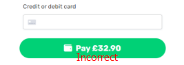

#### Test case №1. Correct

|Number|1|
|---|----|
|Header|Accepting donations|
|Precondition|The charity's website has been launched. The window for entering a donation amount is open.|
|||
|Step|Expected Result|
|Enter the donation amount. Note: the amount can be selected from a set of fixed values, or entered manually. Minimum amount: 5| When selecting from a set of fixed values, the selected value is displayed in the input field. |
||When entering manually, the entered amount is displayed in the input field. If you enter less than 5, the amount automatically becomes 5.|
|To the right of the donation amount entry field is a clickable drop-down menu for currency selection - from several values EUR, GBP, USD| Currency selection is fixed. No currency conversion. |
|Below the drop-down menu is the percentage of service charge - choose from several values, 5%, 7%, 10%.|When selected, the value is fixed.|
|Click the continue button.|Opens the donor data entry page and the message from the donor.|
|The field your message (Optional). Remaining: 150|As you type, the text of the message is displayed. If you enter more than 150 characters, the input stops.|
|The Fields Your Name (Optional)|When you enter a first name - the text is displayed. If you enter a last name, the text is displayed.|
|The Field with checkbox. Appear as an Anonymous Donor publicly on the fundraising page.|If you select - the first name fields become inactive.|
|The Field Email Address (Required)|When you enter - the email is displayed and fixed.|
|Would you like to be contacted by [...] Selecting an item (Required)|The item selection is fixed.|
|Banking charges: Selecting an item (Required) | The item selection is fixed.|
|Click the back button. |A page opens for selecting a donation amount (the data entered is not saved).|
|Click the continue button.| The payment screen page opens.|
|Entry field Credit or debit card| As you enter - the numbers are fixed and hidden. |
|After entering the correct card number, the pay button becomes active. The button displays the amount including bank charges (+2,5%).| When clicked, payment is made. |

#### The Bug Report №1.
| ID        | 1 |
|------|--------|
|Summary|The bank fee is not included in the final amount.|
|Project|The website of a charitable organization.|
|Severity (Scale from S0 to S4).|S3 Critical.|
|Priority (Scale from P1 to P3).|P1 High|
|Status|Open|
|Author|Valentin O.|
|Assigned To|Cool Kick|
|Steps to Playback|Test case №1. Correct - Last step|
|Actual result|After entering the correct card number, the pay button becomes active. But the button does not display the correct amount including the bank commission (+2,5%).|
|Expected result|After entering the correct card number, the pay button becomes active. The button displays the amount including bank charges (+2,5%).|
|Attachment||

#### The Bug Report №2.
| ID        | 2 |
|------|--------|
|Summary|The payment button becomes inaccessible after an attempt to pay with an invalid card number.|
|Project|The website of a charitable organization.|
|Severity (Scale from S0 to S4).|S3 Critical.|
|Priority (Scale from P1 to P3).|P1 High|
|Status|Open|
|Author|Valentin O.|
|Assigned To|Cool Kick|
|Steps to Playback|Test case №1. Correct - Step: Entry field Credit or debit card|
|Actual result|After trying to pay with an invalid card number, the payment button is blocked.|
|Expected result|When clicked, payment is made.|
|Attachment||